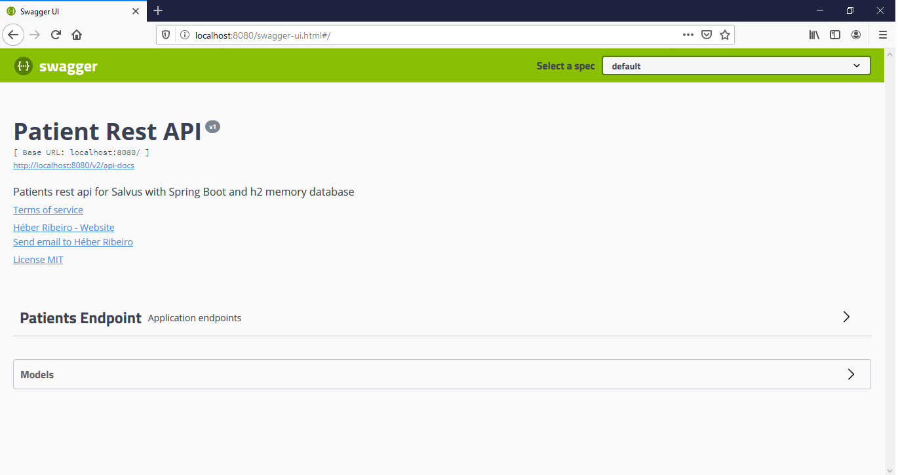
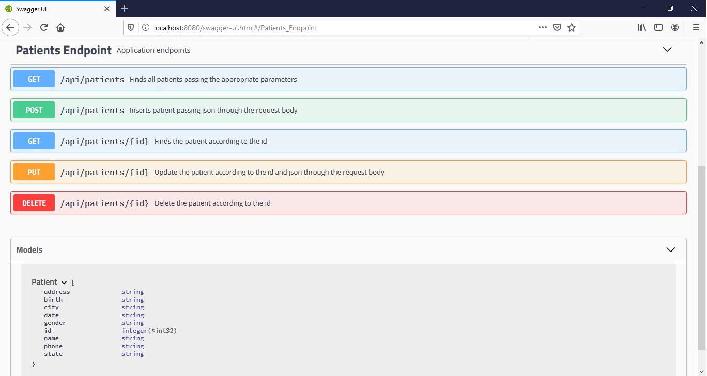

# ***Patient  API Rest***

### Descrição
*API Rest que realiza operações de CRUD de pacientes. Com objetivo de simplificar a execução da aplicação, foi utilizado um banco de dados em memória, dessa forma não é necessário realizar nenhuma instalação e
configuração extra. Ao rodar a aplicação, o banco será iniciado com os registros,
todas as alterações não serão persistidas em disco, e sim em memória, que ficarão disponíveis até o reinício da aplicação.*

### Exigências

Tecnologias e ferramenta para rodar o projeto:

* [Java  (jdk11)](https://www.oracle.com/java/technologies/javase-jdk11-downloads.html)

### Rodando o projeto
Nada, além do jdk11 instalado, é necessário para rodar a aplicação. Apenas atentar para a [configuração da variável de ambiente JAVA_HOME](https://medium.com/@mauriciogeneroso/configurando-java-4-como-configurar-as-vari%C3%A1veis-java-home-path-e-classpath-no-windows-46040950638f) (1 minuto é suficiente para realizar essa configuração). Certo de que possui o jdk11 instalado e a variável de ambiente está configurada, para rodar a aplicação basta clonar, ou mesmo baixar a aplicação, abrir o power shell ou prompt de comando na raiz do projeto e executar o comando:

> ./mvnw spring-boot:run

### Começando

O projeto subirá no host local na porta 8080 (localhost:8080). No endereço       <http://localhost:8080/swagger-ui.html> será apresentada a documentação completa da API, conforme imagem abaixo:





Nesta página, além de conhecer a API com a descrição dos endoints e parâmetros, é possível executar todas as requisições, funcionando como um espécie de "interface".

### Endpoints

##### GET
<localhost:8080/api/patients/{id}>

<localhost:8080/api/patients?page=0&limit=5&direction=asc&attribute=id>

* *page* - Identifica qual página retornada. O valor padrão é zero.
* *limit* - Identifica a quantidade de pacientes retornados por página. O valor padrão é 5.
* *direction* - Define a ordenação da busca, se crescente ou decrescente. O valor padrão é "*asc*". Caso queira decrescente, colocar "*desc*" como parâmetro.
* *attribute* - Identifica qual atributo do paciente será usado para ordenar a busca. A ordenação padrão é pelo *id* do paciente.

```
Body Response:

[
  {
    "id": 1,
    "name": "Rayna Middlebrook",
    "gender": "Female",
    "birth": "27/01/1909",
    "phone": "(850) 8365234",
    "address": "1740 Talmadge Crossing",
    "city": "Pensacola",
    "state": "FL"
  },
  {
    "id": 2,
    "name": "Eldridge Bothram",
    "gender": "Male",
    "birth": "16/10/1991",
    "phone": "(360) 9592441",
    "address": "54679 Carpenter Alley",
    "city": "Olympia",
    "state": "WA"
  },
  {
    "id": 3,
    "name": "Benita Graddell",
    "gender": "Female",
    "birth": "06/08/2011",
    "phone": "(202) 3775761",
    "address": "656 Cardinal Park",
    "city": "Washington",
    "state": "DC"
  },
  {
    "id": 4,
    "name": "Zola Gleadhall",
    "gender": "Female",
    "birth": "26/03/1988",
    "phone": "(414) 4639777",
    "address": "3170 Ryan Point",
    "city": "Milwaukee",
    "state": "WI"
  },
  {
    "id": 5,
    "name": "Johan Hampson",
    "gender": "Male",
    "birth": "27/09/1952",
    "phone": "(703) 5028394",
    "address": "4 Swallow Lane",
    "city": "Washington",
    "state": "DC"
  }
]
```
***
#### POST
<localhost:8080/api/patients>
```
Body Request

{
  "address": "9328 Rowland Parkway",
  "birth": "25/12/1980",
  "city": "	Philadelphia",
  "gender": "Male",
  "name": "Dionisio Stainland",
  "phone": "(254) 3711170",
  "state": "DC"
}
```
***
#### PUT
<localhost:8080/api/patients/{id}>
```
Body Request

{
  "address": "45792 Center Avenue",
  "birth": "15/08/1979",
  "city": "Marietta",
  "gender": "Female",
  "name": "Katha Junkinson",
  "phone": "(770) 9891062",
  "state": "GA"
}
```
***
#### DELETE

<localhost:8080/api/patients/{id}>

***

### Requisições com Insomia
No projeto, há uma pasta chamada *assets* no caminho *src\main\resources\assets*,
nela existe um arquivo chamado *Insomnia V4 (JSON).json*. É possível importar esse arquivo com o Insomnia com as requisições e o workspace configurado para realizar as requisições.

### Possíveis problemas na execução

###### *Porta 8080 ocupada*

Neste caso, a solução mais simples é matar o processo em execução nesta porta.
Para isso, execute o comando:
> netstat -a -n -o

Será listado os processos em execução. Identifique qual PID corresponde à porta 8080. Depois disso, execute o comando:

> taskkill /PID <*pid*>

No lugar de <*pid*>, digite o número do PID identificado.

###### JRE ao invés do JDK
Também é possível que o usuário tenha instalado o Java Runtime Enviroment (*JRE*). No entanto para rodar a aplicação é necessário o [JDK11](https://www.oracle.com/java/technologies/javase-jdk11-downloads.html).

### Tecnologias e ferramentas usadas no projeto

* Java 11
* Spring Boot version: 2.3.0
* Apache Maven version 3.6.3
* h2 database
* Eclipse
